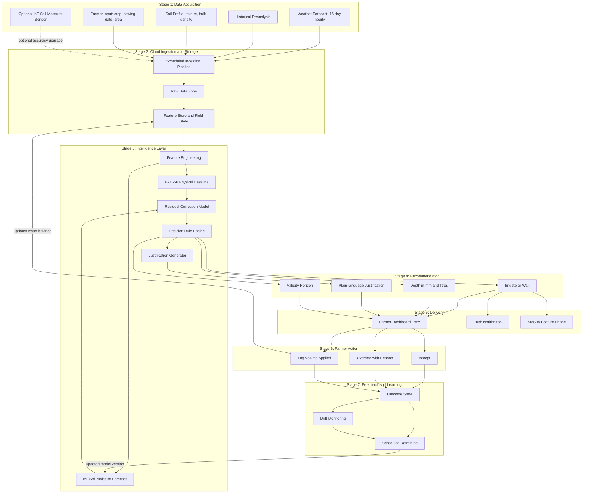

# Cloud-Based Smart Irrigation Recommendation using Weather Intelligence

**Course:** BITE412L — Cloud Computing
**Instructor:** Dr. Priya V
**Project Cluster:** Cluster C — Intelligent Agriculture & Food Security Cloud
**Sustainable Development Goal:** SDG 2 — Zero Hunger
**Cloud Platform:** Microsoft Azure
**Phase:** Phase-I — Planning and Documentation

---

## Project Status

> **Phase-I: Planning and Documentation.**
> Code implementation is **not** required at this stage and has not been undertaken.
> This repository contains the project plan, work allocation, proposed folder structure,
> architecture design, literature survey and research gap analysis.
> Every folder carries a README describing what will be built there in later phases.

> **Phase-II: Implementation.** *Updated 5 September 2026.*
> The FAO-56 engine, the power-window scheduler, the voice and missed-call
> channel, the Azure Functions app and the infrastructure as code are built and
> tested: **1,270 tests**, `ruff` and `mypy --strict` clean, five CI jobs green
> on every push. The daily loop runs end to end for three pilot farmers with
> `make demo`, using live Open-Meteo data and no Azure resource at all.
> Measured results are in [`results/README.md`](results/README.md); every number
> in this repository traces to a file there.

---

## Table of Contents

1. [Project Title and Overview](#project-title-and-overview)
2. [Team Members](#team-members)
3. [Problem Statement](#problem-statement)
4. [Objectives](#objectives)
5. [Phase-II Scope Refinement](#phase-ii-scope-refinement)
6. [Phase-II Acceptance Mapping](#phase-ii-acceptance-mapping)
7. [Proposed Architecture / Framework](#proposed-architecture--framework)
8. [Technology Stack](#technology-stack)
9. [Dataset Details](#dataset-details)
10. [How to Run](#how-to-run)
11. [Repository Structure](#repository-structure)
12. [Branch Workflow](#branch-workflow)
13. [Documentation Index](#documentation-index)

---

## Project Title and Overview

**Cloud-Based Smart Irrigation Recommendation using Weather Intelligence**

A cloud platform that converts freely available weather forecast data, historical
reanalysis and open global soil maps into a specific, justified irrigation
instruction for an individual field — delivered to the farmer through a dashboard,
push notification or SMS.

The system answers two questions every day, for every registered field:

- **Should this field be irrigated today, or should it wait?**
- **If it should be irrigated, how much water should be applied?**

Each recommendation carries a one-line justification naming the two dominant
factors behind it, and a stated validity horizon.

**The defining design decision** is that weather forecast data is the *primary*
signal, not an optional refinement. Soil moisture sensors are supported but are
never required — a field with no hardware at all receives a usable recommendation
on the day it is registered.

---

## Team Members

| Student | Register Number | Name | Phase-I Responsibility | Future Module Ownership |
|---|---|---|---|---|
| Student 1 | 23BIT0390 | Nayan Jaggi | Literature survey and research gap, papers 1–5 (irrigation scheduling and decision support) | Frontend development |
| Student 2 | 23BIT0416 | Aarush Pandit | Literature survey and research gap, papers 6–10 (cloud, IoT and distributed learning); architecture design; repository setup | Backend development and database integration |
| Student 3 | 23BIT0428 | Krishna Agrawal | Literature survey and research gap, papers 11–15 (predictive modelling) | AI / Machine Learning |

Literature survey, research gap analysis, Azure cloud services, testing,
documentation, presentation and GitHub commits are shared responsibilities across
all three members. See [`docs/WORK_DISTRIBUTION.md`](docs/WORK_DISTRIBUTION.md)
for the full breakdown.

---

## Problem Statement

Irrigation is the largest consumptive use of freshwater in Indian agriculture and
also the least instrumented. For most cultivators the irrigation decision reduces
to a fixed weekly interval, a visual check of surface soil, or an imitation of
neighbouring fields. None of these heuristics responds to the two variables that
actually determine crop water demand — atmospheric evaporative demand and imminent
rainfall.

Three failures follow:

1. **Water is applied when it is not required.** A field irrigated the evening
   before rainfall receives water twice, saturating the root zone and leaching
   dissolved nitrogen below the roots.
2. **Water is withheld when it is required.** Surface soil dries faster than the
   root zone, so visual inspection systematically misjudges depletion under high
   evaporative demand, and the resulting stress lands during flowering or grain
   filling where the yield penalty is largest.
3. **The volume applied is unquantified.** Even with correct timing, depth is set
   by how long the pump ran rather than by the accumulated deficit.

The technologies that could fix this exist but do not reach the farms that need
them. Automated controllers need sensors, actuators and field power. Research-grade
scheduling tools need site-specific calibration and a trained operator. Published
predictive models output a moisture trajectory or an evapotranspiration value, not
an irrigation depth and a date. Meanwhile high-resolution numerical weather
forecasts covering every cultivated hectare in India are free, updated several
times daily, and used by almost none of these systems as their primary driver.

**The gap this project addresses is translation and delivery, not prediction
accuracy** — a low-cost, sensor-optional cloud service that turns free forecast,
reanalysis and open soil data into a specific irrigation instruction delivered
through a channel the farmer already uses.

---

## Objectives

| # | Objective | Acceptance Criterion |
|---|---|---|
| 1 | Build a scheduled cloud pipeline ingesting weather forecast, historical reanalysis and open soil data for every registered field | Ingestion success rate ≥ 99% over a rolling 30-day window; no field holding forecast data older than 24 hours |
| 2 | Implement an FAO-56 reference evapotranspiration and root-zone water balance module producing an irrigation depth in millimetres | Computed ET₀ within ±0.2 mm/day of the FAO-56 Penman–Monteith reference on ≥ 365 held-out station-days |
| 3 | Train and deploy a model forecasting root-zone soil moisture 1–7 days ahead using only free public data | R² ≥ 0.80 on a held-out season, with RMSE within the defined tolerance |
| 4 | Deliver a daily decision, depth, plain-language justification and validity horizon via dashboard and push/SMS | End-to-end latency under 5 minutes for 95% of recommendations; every record carries a non-empty justification |
| 5 | Deploy securely and observably on Azure | Zero secrets in the repository (automated scan); all data-plane services behind private endpoints or authenticated gateways; ≥ 5 configured Azure Monitor alert rules |
| 6 | Quantify water saved against a fixed-interval baseline in simulation | ≥ 20% reduction in applied water with no increase in modelled crop water stress days |

---

## Phase-II Scope Refinement

*Added 5 September 2026. The Phase-I problem statement, objectives and novelty
above are unchanged; this section states how Phase-II sharpens them.*

Phase-I named the gap as **translation and delivery**: turning free forecast,
reanalysis and soil data into a specific instruction, through a channel the
farmer already uses. Phase-II does not replace that gap. It fixes both halves of
it.

**The translation target becomes pump minutes inside the farmer's rationed
electricity window.** Irrigation advisories answer *when does the crop need
water*. For most Indian pump owners that is not the binding question; the binding
question is *when can the pump run at all*. Agricultural feeders are supplied for
a fixed number of hours a day on a rotating schedule, often at night, and
DISCOMs publish those windows. An advisory that says "irrigate Tuesday
afternoon" to a farmer whose feeder is live on Tuesday night is agronomically
correct and operationally useless. No farmer-facing advisory found in the
Phase-II literature search takes the feeder window as a scheduling input.

**The delivery channel becomes a voice call plus three missed-call numbers.**
This needs no literacy, no smartphone and no data pack. The missed call is free
to the farmer, because the platform rejects the call without answering it, and
it is the only sensor the system has: ring A for *water given*, B for *power did
not come*, C for *say today's plan again*.

Supporting economics and policy sources are in
[`literature_survey/phase2_addendum.md`](literature_survey/phase2_addendum.md),
marked supplementary and outside the fifteen mandated papers, which are
untouched.

The full refinement, including the reconciliation of every Phase-I objective,
service and dataset, is
[`docs/PHASE2_NOVELTY_AND_PLAN.md`](docs/PHASE2_NOVELTY_AND_PLAN.md).

---

## Phase-II Acceptance Mapping

Every Phase-I objective keeps its criterion. This table records what was
measured against it. Objectives 2 and 6 are reported as **not met at their
stated thresholds**, with the measurement and its consequences, rather than
restated or quietly adjusted.

| # | Phase-I criterion | Status | Measured |
|---|---|---|---|
| 1 | Ingestion ≥ 99% over 30 days, no forecast older than 24 h | Implemented, not yet measured | Providers built and tested; the 30-day window needs a deployment. Alert rule `ingest-failure` is in the Bicep |
| 2 | ET₀ within ±0.2 mm/day of the FAO-56 reference on ≥ 365 station-days | **Not met at 0.2 mm/day** | 1,095 station-days. MAE **0.279 mm/day**, bias **+0.065**. Implementation verified correct against FAO-56 Example 18 on every printed intermediate. The residual is smaller than the disagreement between two reanalysis products (0.735 mm/day) |
| 3 | Soil-moisture model, R² ≥ 0.80 on a held-out season | Owned by Krishna Agrawal, in progress | Kept off the critical path behind the `MoistureForecaster` protocol, with a `KcEt0Forecaster` fallback that always works |
| 4 | Daily decision, depth, justification and horizon delivered | Implemented | Voice call in three languages plus the icon-only PWA. Every schedule carries a reason code that maps to plain words. Live delivery is blocked by the phone-number restriction below |
| 5 | Secure, observable Azure deployment, ≥ 5 alert rules | Implemented as code | Managed identity throughout, Cosmos local auth disabled, Key Vault RBAC, five alert rules in Bicep, gitleaks in CI. Authenticated gateways in place of private endpoints |
| 6 | ≥ 20% less water than fixed-interval, no increase in stress days | **Not met on water; met on stress days** | P3 applies **9.8% less** water than fixed-interval, short of the 20% criterion, with **84.8% fewer stress days** and 36.1% less deep percolation. Against a conventional advisory under the same power constraint: **83.3% fewer stress days at 29.4% higher water use**. Six non-ponded fields; rice is excluded from the headline because `crops.yaml` states a depletion balance is the wrong model for it |

The Objective 6 result is the substantive finding, not a shortfall to apologise
for: **the scheduler buys reliability with water**, because it must refill early
against a window that may not arrive. An earlier run of this simulation reported
P3 using *more* water than fixed-interval irrigation; that number was produced by
a carry-over double count in the scheduler, which is fixed, tested and recorded
in the build log. Full analysis, including the measured
price of rationed electricity, is in [`results/README.md`](results/README.md).

---

## Proposed Architecture / Framework

Two architecture diagrams are maintained in [`architecture/`](architecture/):

- **[Azure Cloud Architecture](architecture/azure_cloud_architecture.md)** — how the
  Azure services interact, showing data flow, storage, processing, authentication,
  notifications and monitoring.
- **[Complete System Architecture](architecture/system_architecture.md)** — the
  end-to-end project workflow (this diagram, reproduced below).

### Complete System Architecture



Exported PNG and editable `.drawio` sources for both diagrams live in
[`architecture/`](architecture/).

---

## Technology Stack

| Layer | Technology |
|---|---|
| **Frontend** | React 18 with Vite, Tailwind CSS, Recharts, Progressive Web App with offline cache, multilingual (English / Hindi / Tamil) |
| **Backend** | Python 3.11, FastAPI, Azure Functions Python worker, Pydantic |
| **AI / ML** | pandas, NumPy, scikit-learn, XGBoost, TensorFlow with Keras (LSTM), SHAP, MLflow via Azure ML |
| **Database** | Azure SQL Database (relational and audit), Azure Cosmos DB (per-field state), Azure Cache for Redis (forecast cache) |
| **Cloud** | Microsoft Azure — Data Factory, Functions, Blob Storage, Cosmos DB, SQL Database, Machine Learning, Container Registry, Entra ID, API Management, Key Vault, Notification Hubs, Communication Services, Service Bus, Cache for Redis, Monitor, Application Insights, Virtual Network, WAF with Front Door, Static Web Apps, App Service, Backup, Power BI |
| **DevOps** | Git, GitHub, GitHub Actions, Azure Bicep, Docker, pytest, ruff, automated secret scanning |

---

## Dataset Details

Full specification with all required fields is in [`dataset/README.md`](dataset/README.md).
Summary:

| Source | Type | Licence | Role |
|---|---|---|---|
| Open-Meteo Forecast API | Weather forecast, 16-day hourly | CC BY 4.0 | Primary decision driver |
| Open-Meteo Historical Archive | ERA5 / ERA5-Land reanalysis | CC BY 4.0 | Model training corpus |
| NASA POWER Daily API | Agroclimatology, 300+ parameters | CC BY 4.0 | ET drivers and cross-validation |
| ISRIC SoilGrids 2.0 | Global soil properties at 250 m | CC BY 4.0 | Field capacity and wilting point |
| Crop Irrigation Scheduling (Kaggle) | Labelled tabular, 6 attributes | To be confirmed | Supervised training labels |
| International Soil Moisture Network | In-situ soil moisture | Per contributing network | Independent validation |


**Phase-II additions and status changes** *(added 5 September 2026)*

| Source | Type | Licence | Role |
|---|---|---|---|
| D7 · MSEDCL AgLM feeder schedule circulars | PDF tables: substation, feeder, 8-hour window | Public government circular · *TODO [VERIFY] reuse terms* | Ground truth for power windows in the Maharashtra pilot districts |
| D8 · Open-Meteo Previous Runs API | Forecasts as they were issued on earlier days | CC BY 4.0 | Training pairs for rain calibration, and the **forecast-as-issued** input that keeps hindsight out of the Objective 6 simulation |
| D9 · Farmer missed-call and call-outcome events | Event log | Own data, consented | The only sensor: feedback loop, feeder reliability score, compliance |

Status changes to the Phase-I sources. **Nothing is withdrawn.**

- **D4 · ISRIC SoilGrids — role restated as prefill, not primary.** It returned
  every property null for all three pilot points, and Phase-I already recorded
  that its REST API had been paused. The farmer's own answer to a three-choice
  soil question is now the primary input; SoilGrids prefills it where it
  responds. This is also the better design: a farmer's answer describes *his
  plot*, while a SoilGrids value describes a 250 m pixel that may straddle a
  road, a canal and three holdings.
- **D5 · Kaggle Crop Irrigation Scheduling — retained, optional, Objective 3
  only.** Not used by the deterministic decision path.
- **D6 · International Soil Moisture Network — retained as the independent
  validation set for Objective 3.**

No API keys are required for D1 to D4 or D8, and none is stored in this
repository.

---

## How to Run

Python 3.11 or 3.12. Nothing below needs an Azure subscription, an API key or a
phone number.

```bash
make setup            # virtualenv, install the engine with dev dependencies
make test             # 1,270 tests. No network: a unit test that opens a socket fails
make lint             # ruff, ruff format --check, mypy --strict
```

**See the system work.** Seeds three pilot farmers in Vellore, Beed and
Ludhiana, pulls live Open-Meteo forecast data, runs the whole chain, prints the
script each farmer would hear in his own language, and writes a browser call
console with buttons standing in for his phone:

```bash
make demo             # live data
make demo-offline     # fixed data, for a room with bad wifi
```

**Inspect what a farmer hears.** Writes every rendered script, in every
language, for every schedule state, to `results/script_samples.txt` in UTF-8 —
a terminal cannot be trusted to render Devanagari or Tamil correctly:

```bash
make script-samples
```

**Reproduce the measured results.** These reach the public APIs and take a few
minutes each:

```bash
make sim              # Objective 6: five policies, two seasons, nine fields
make validate         # Objective 2: ET0 against 1,095 station-days
make validate-inputs  # is the residual a method or an input-data difference?
make sensitivity      # what the ET0 error costs in pump minutes. No network
```

**Infrastructure.** `deploy-plan` previews and changes nothing; `deploy` is for
the repository owner after `az login`:

```bash
make bicep-build      # compile the Bicep to ARM. No Azure needed
make deploy-plan      # az deployment group what-if
```

Run `make help` for the full list.

---

## Repository Structure

```
SmartIrrigation_Azure_Cloud_Project_2026/
│
├── README.md                     # This file
├── .gitignore
│
├── docs/                         # Project documentation and work allocation
│   ├── README.md
│   └── WORK_DISTRIBUTION.md
│
├── literature_survey/            # 15-paper survey and per-student research gaps
│   ├── README.md
│   ├── literature_survey.md
│   ├── research_gap_23BIT0390.md
│   ├── research_gap_23BIT0416.md
│   └── research_gap_23BIT0428.md
│
├── architecture/                 # Both mandatory architecture diagrams
│   ├── README.md
│   ├── azure_cloud_architecture.md
│   └── system_architecture.md
│
├── dataset/                      # Dataset specification and preprocessing plan
│   └── README.md
│
├── src/                          # Source code (Phase-II onward — empty at Phase-I)
│   ├── README.md
│   ├── frontend/README.md
│   ├── backend/README.md
│   ├── ai_model/README.md
│   └── azure/README.md
│
├── results/                      # Experimental results (Phase-III)
│   └── README.md
│
├── presentation/                 # Review slide decks
│   └── README.md
│
└── references/                   # All 15 papers in IEEE citation format
    └── README.md
```

---

## Branch Workflow

```
                    main
                      │
                   develop
        ┌─────────────┼─────────────┐
        │             │             │
feature/student1  feature/student2  feature/student3
   (Nayan)          (Aarush)         (Krishna)
```

- `main` — final stable version. **No direct commits.**
- `develop` — integration branch. All feature work merges here first.
- `feature/studentN` — individual development branches.

**Standard workflow:**

```bash
git clone https://github.com/aarush093/SmartIrrigation_Azure_Cloud_Project_2026.git
cd SmartIrrigation_Azure_Cloud_Project_2026
git checkout feature/studentN
# ... make changes ...
git add .
git commit -m "Descriptive message"
git push origin feature/studentN
# Open a Pull Request: feature/studentN -> develop
# Teammates review, resolve comments, merge
# When stable: develop -> main, then tag the release
```

Releases are tagged (for example `v0.1-Phase1-planning`).

---

## Documentation Index

| Document | Contents |
|---|---|
| [`docs/WORK_DISTRIBUTION.md`](docs/WORK_DISTRIBUTION.md) | Per-member responsibilities, Phase-I split and planned module ownership |
| [`literature_survey/literature_survey.md`](literature_survey/literature_survey.md) | 15-paper survey table and full citations |
| [`literature_survey/research_gap_23BIT0390.md`](literature_survey/research_gap_23BIT0390.md) | Nayan Jaggi — gap analysis, papers 1–5 |
| [`literature_survey/research_gap_23BIT0416.md`](literature_survey/research_gap_23BIT0416.md) | Aarush Pandit — gap analysis, papers 6–10 |
| [`literature_survey/research_gap_23BIT0428.md`](literature_survey/research_gap_23BIT0428.md) | Krishna Agrawal — gap analysis, papers 11–15 |
| [`architecture/azure_cloud_architecture.md`](architecture/azure_cloud_architecture.md) | Diagram 1 with Azure service explanation |
| [`architecture/system_architecture.md`](architecture/system_architecture.md) | Diagram 2 with workflow explanation |
| [`dataset/README.md`](dataset/README.md) | Full dataset specification and preprocessing plan |
| [`docs/PHASE2_NOVELTY_AND_PLAN.md`](docs/PHASE2_NOVELTY_AND_PLAN.md) | **Phase-II specification.** Scheduler policy (§7), evaluation (§12), reconciliation with Phase-I (§17) |
| [`docs/PHASE2_BUILD_LOG.md`](docs/PHASE2_BUILD_LOG.md) | Dated engineering record: every decision, deviation and defect found |
| [`docs/ACS_MISSED_CALL_FEASIBILITY.md`](docs/ACS_MISSED_CALL_FEASIBILITY.md) | Whether the missed-call channel works, and why no phone number can be provisioned |
| [`docs/AZURE_SERVICES_PHASE2.md`](docs/AZURE_SERVICES_PHASE2.md) | Every Azure service with status, tier and purpose |
| [`docs/HANDOFF_STATUS.md`](docs/HANDOFF_STATUS.md) | What the other two students own and what is prepared for them |
| [`docs/REVIEW2_VIVA_NOTES.md`](docs/REVIEW2_VIVA_NOTES.md) | Likely faculty questions per module, with answers |
| [`results/README.md`](results/README.md) | **Every measured number in this project**, with its method |
| [`literature_survey/phase2_addendum.md`](literature_survey/phase2_addendum.md) | Supplementary sources for the Phase-II refinement |
| [`references/README.md`](references/README.md) | All references in IEEE format |

---

*BITE412L Cloud Computing — Phase-I Submission — 31 July 2026*
