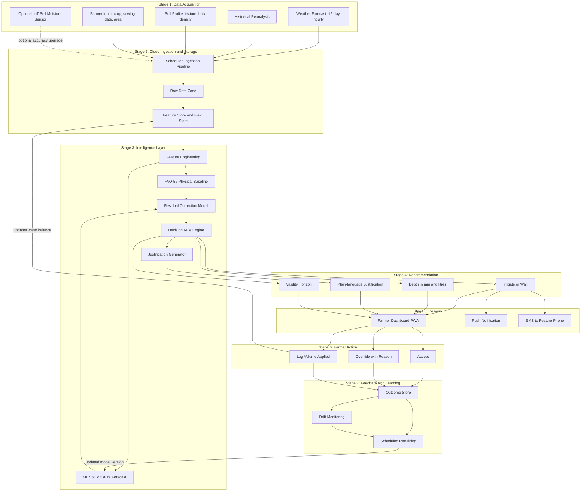

# Cloud-Based Smart Irrigation Recommendation using Weather Intelligence

**Course:** BITE412L — Cloud Computing
**Instructor:** Dr. Priya V
**Project Cluster:** Cluster C — Intelligent Agriculture & Food Security Cloud
**Sustainable Development Goal:** SDG 2 — Zero Hunger
**Cloud Platform:** Microsoft Azure
**Phase:** Phase-I — Planning and Documentation

---

## Project Status

> **Phase-I: Planning and Documentation.**
> Code implementation is **not** required at this stage and has not been undertaken.
> This repository contains the project plan, work allocation, proposed folder structure,
> architecture design, literature survey and research gap analysis.
> Every folder carries a README describing what will be built there in later phases.

---

## Table of Contents

1. [Project Title and Overview](#project-title-and-overview)
2. [Team Members](#team-members)
3. [Problem Statement](#problem-statement)
4. [Objectives](#objectives)
5. [Proposed Architecture / Framework](#proposed-architecture--framework)
6. [Technology Stack](#technology-stack)
7. [Dataset Details](#dataset-details)
8. [Repository Structure](#repository-structure)
9. [Branch Workflow](#branch-workflow)
10. [Documentation Index](#documentation-index)

---

## Project Title and Overview

**Cloud-Based Smart Irrigation Recommendation using Weather Intelligence**

A cloud platform that converts freely available weather forecast data, historical
reanalysis and open global soil maps into a specific, justified irrigation
instruction for an individual field — delivered to the farmer through a dashboard,
push notification or SMS.

The system answers two questions every day, for every registered field:

- **Should this field be irrigated today, or should it wait?**
- **If it should be irrigated, how much water should be applied?**

Each recommendation carries a one-line justification naming the two dominant
factors behind it, and a stated validity horizon.

**The defining design decision** is that weather forecast data is the *primary*
signal, not an optional refinement. Soil moisture sensors are supported but are
never required — a field with no hardware at all receives a usable recommendation
on the day it is registered.

---

## Team Members

| Student | Register Number | Name | Phase-I Responsibility | Future Module Ownership |
|---|---|---|---|---|
| Student 1 | 23BIT0390 | Nayan Jaggi | Literature survey and research gap, papers 1–5 (irrigation scheduling and decision support) | Frontend development |
| Student 2 | 23BIT0416 | Aarush Pandit | Literature survey and research gap, papers 6–10 (cloud, IoT and distributed learning); architecture design; repository setup | Backend development and database integration |
| Student 3 | 23BIT0428 | Krishna Agrawal | Literature survey and research gap, papers 11–15 (predictive modelling) | AI / Machine Learning |

Literature survey, research gap analysis, Azure cloud services, testing,
documentation, presentation and GitHub commits are shared responsibilities across
all three members. See [`docs/WORK_DISTRIBUTION.md`](docs/WORK_DISTRIBUTION.md)
for the full breakdown.

---

## Problem Statement

Irrigation is the largest consumptive use of freshwater in Indian agriculture and
also the least instrumented. For most cultivators the irrigation decision reduces
to a fixed weekly interval, a visual check of surface soil, or an imitation of
neighbouring fields. None of these heuristics responds to the two variables that
actually determine crop water demand — atmospheric evaporative demand and imminent
rainfall.

Three failures follow:

1. **Water is applied when it is not required.** A field irrigated the evening
   before rainfall receives water twice, saturating the root zone and leaching
   dissolved nitrogen below the roots.
2. **Water is withheld when it is required.** Surface soil dries faster than the
   root zone, so visual inspection systematically misjudges depletion under high
   evaporative demand, and the resulting stress lands during flowering or grain
   filling where the yield penalty is largest.
3. **The volume applied is unquantified.** Even with correct timing, depth is set
   by how long the pump ran rather than by the accumulated deficit.

The technologies that could fix this exist but do not reach the farms that need
them. Automated controllers need sensors, actuators and field power. Research-grade
scheduling tools need site-specific calibration and a trained operator. Published
predictive models output a moisture trajectory or an evapotranspiration value, not
an irrigation depth and a date. Meanwhile high-resolution numerical weather
forecasts covering every cultivated hectare in India are free, updated several
times daily, and used by almost none of these systems as their primary driver.

**The gap this project addresses is translation and delivery, not prediction
accuracy** — a low-cost, sensor-optional cloud service that turns free forecast,
reanalysis and open soil data into a specific irrigation instruction delivered
through a channel the farmer already uses.

---

## Objectives

| # | Objective | Acceptance Criterion |
|---|---|---|
| 1 | Build a scheduled cloud pipeline ingesting weather forecast, historical reanalysis and open soil data for every registered field | Ingestion success rate ≥ 99% over a rolling 30-day window; no field holding forecast data older than 24 hours |
| 2 | Implement an FAO-56 reference evapotranspiration and root-zone water balance module producing an irrigation depth in millimetres | Computed ET₀ within ±0.2 mm/day of the FAO-56 Penman–Monteith reference on ≥ 365 held-out station-days |
| 3 | Train and deploy a model forecasting root-zone soil moisture 1–7 days ahead using only free public data | R² ≥ 0.80 on a held-out season, with RMSE within the defined tolerance |
| 4 | Deliver a daily decision, depth, plain-language justification and validity horizon via dashboard and push/SMS | End-to-end latency under 5 minutes for 95% of recommendations; every record carries a non-empty justification |
| 5 | Deploy securely and observably on Azure | Zero secrets in the repository (automated scan); all data-plane services behind private endpoints or authenticated gateways; ≥ 5 configured Azure Monitor alert rules |
| 6 | Quantify water saved against a fixed-interval baseline in simulation | ≥ 20% reduction in applied water with no increase in modelled crop water stress days |

---

## Proposed Architecture / Framework

Two architecture diagrams are maintained in [`architecture/`](architecture/):

- **[Azure Cloud Architecture](architecture/azure_cloud_architecture.md)** — how the
  Azure services interact, showing data flow, storage, processing, authentication,
  notifications and monitoring.
- **[Complete System Architecture](architecture/system_architecture.md)** — the
  end-to-end project workflow (this diagram, reproduced below).

### Complete System Architecture



Exported PNG and editable `.drawio` sources for both diagrams live in
[`architecture/`](architecture/).

---

## Technology Stack

| Layer | Technology |
|---|---|
| **Frontend** | React 18 with Vite, Tailwind CSS, Recharts, Progressive Web App with offline cache, multilingual (English / Hindi / Tamil) |
| **Backend** | Python 3.11, FastAPI, Azure Functions Python worker, Pydantic |
| **AI / ML** | pandas, NumPy, scikit-learn, XGBoost, TensorFlow with Keras (LSTM), SHAP, MLflow via Azure ML |
| **Database** | Azure SQL Database (relational and audit), Azure Cosmos DB (per-field state), Azure Cache for Redis (forecast cache) |
| **Cloud** | Microsoft Azure — Data Factory, Functions, Blob Storage, Cosmos DB, SQL Database, Machine Learning, Container Registry, Entra ID, API Management, Key Vault, Notification Hubs, Communication Services, Service Bus, Cache for Redis, Monitor, Application Insights, Virtual Network, WAF with Front Door, Static Web Apps, App Service, Backup, Power BI |
| **DevOps** | Git, GitHub, GitHub Actions, Azure Bicep, Docker, pytest, ruff, automated secret scanning |

---

## Dataset Details

Full specification with all required fields is in [`dataset/README.md`](dataset/README.md).
Summary:

| Source | Type | Licence | Role |
|---|---|---|---|
| Open-Meteo Forecast API | Weather forecast, 16-day hourly | CC BY 4.0 | Primary decision driver |
| Open-Meteo Historical Archive | ERA5 / ERA5-Land reanalysis | CC BY 4.0 | Model training corpus |
| NASA POWER Daily API | Agroclimatology, 300+ parameters | CC BY 4.0 | ET drivers and cross-validation |
| ISRIC SoilGrids 2.0 | Global soil properties at 250 m | CC BY 4.0 | Field capacity and wilting point |
| Crop Irrigation Scheduling (Kaggle) | Labelled tabular, 6 attributes | To be confirmed | Supervised training labels |
| International Soil Moisture Network | In-situ soil moisture | Per contributing network | Independent validation |

No API keys are required for the four primary sources, and none is stored in this
repository.

---

## Repository Structure

```
SmartIrrigation_Azure_Cloud_Project_2026/
│
├── README.md                     # This file
├── .gitignore
│
├── docs/                         # Project documentation and work allocation
│   ├── README.md
│   └── WORK_DISTRIBUTION.md
│
├── literature_survey/            # 15-paper survey and per-student research gaps
│   ├── README.md
│   ├── literature_survey.md
│   ├── research_gap_23BIT0390.md
│   ├── research_gap_23BIT0416.md
│   └── research_gap_23BIT0428.md
│
├── architecture/                 # Both mandatory architecture diagrams
│   ├── README.md
│   ├── azure_cloud_architecture.md
│   └── system_architecture.md
│
├── dataset/                      # Dataset specification and preprocessing plan
│   └── README.md
│
├── src/                          # Source code (Phase-II onward — empty at Phase-I)
│   ├── README.md
│   ├── frontend/README.md
│   ├── backend/README.md
│   ├── ai_model/README.md
│   └── azure/README.md
│
├── results/                      # Experimental results (Phase-III)
│   └── README.md
│
├── presentation/                 # Review slide decks
│   └── README.md
│
└── references/                   # All 15 papers in IEEE citation format
    └── README.md
```

---

## Branch Workflow

```
                    main
                      │
                   develop
        ┌─────────────┼─────────────┐
        │             │             │
feature/student1  feature/student2  feature/student3
   (Nayan)          (Aarush)         (Krishna)
```

- `main` — final stable version. **No direct commits.**
- `develop` — integration branch. All feature work merges here first.
- `feature/studentN` — individual development branches.

**Standard workflow:**

```bash
git clone https://github.com/aarush093/SmartIrrigation_Azure_Cloud_Project_2026.git
cd SmartIrrigation_Azure_Cloud_Project_2026
git checkout feature/studentN
# ... make changes ...
git add .
git commit -m "Descriptive message"
git push origin feature/studentN
# Open a Pull Request: feature/studentN -> develop
# Teammates review, resolve comments, merge
# When stable: develop -> main, then tag the release
```

Releases are tagged (for example `v0.1-Phase1-planning`).

---

## Documentation Index

| Document | Contents |
|---|---|
| [`docs/WORK_DISTRIBUTION.md`](docs/WORK_DISTRIBUTION.md) | Per-member responsibilities, Phase-I split and planned module ownership |
| [`literature_survey/literature_survey.md`](literature_survey/literature_survey.md) | 15-paper survey table and full citations |
| [`literature_survey/research_gap_23BIT0390.md`](literature_survey/research_gap_23BIT0390.md) | Nayan Jaggi — gap analysis, papers 1–5 |
| [`literature_survey/research_gap_23BIT0416.md`](literature_survey/research_gap_23BIT0416.md) | Aarush Pandit — gap analysis, papers 6–10 |
| [`literature_survey/research_gap_23BIT0428.md`](literature_survey/research_gap_23BIT0428.md) | Krishna Agrawal — gap analysis, papers 11–15 |
| [`architecture/azure_cloud_architecture.md`](architecture/azure_cloud_architecture.md) | Diagram 1 with Azure service explanation |
| [`architecture/system_architecture.md`](architecture/system_architecture.md) | Diagram 2 with workflow explanation |
| [`dataset/README.md`](dataset/README.md) | Full dataset specification and preprocessing plan |
| [`references/README.md`](references/README.md) | All references in IEEE format |

---

*BITE412L Cloud Computing — Phase-I Submission — 31 July 2026*
