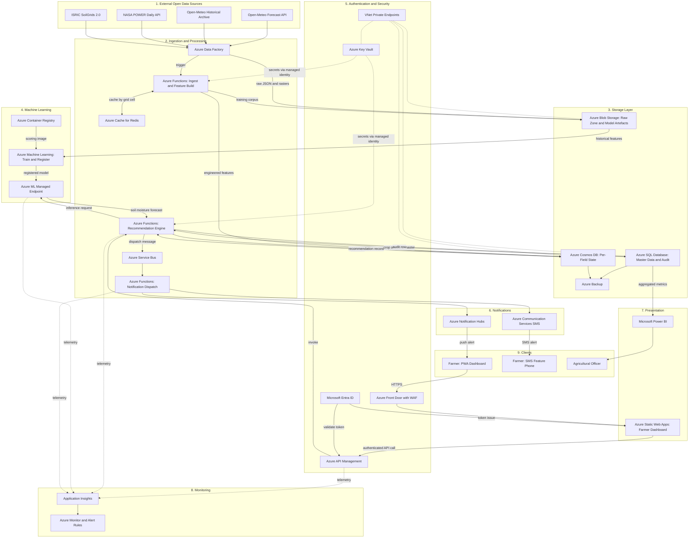

# Diagram 1 — Azure Cloud Architecture

**Project:** Cloud-Based Smart Irrigation Recommendation using Weather Intelligence
**Course:** BITE412L — Cloud Computing | **Instructor:** Dr. Priya V

This diagram shows how the Azure services interact, covering the six elements
required by the Phase-I guidelines: data flow, storage, processing,
authentication, notifications and monitoring.

---

## Diagram

---

## Coverage of the six required elements

| Required element | Where it appears |
|---|---|
| **Data flow** | External Open Data Sources → Data Factory → Blob raw zone → feature computation → Cosmos DB field state → Recommendation Engine → Service Bus → Notification dispatch → client devices, plus the return path from farmer action into the SQL audit store |
| **Storage** | Blob Storage (raw zone and model artefacts), Cosmos DB (per-field state and time series), SQL Database (relational master data and recommendation audit), Azure Backup |
| **Processing** | Data Factory orchestration, three Azure Functions, Service Bus decoupling, Redis forecast cache, and the Machine Learning band for training and inference |
| **Authentication** | Microsoft Entra ID issuing tokens to Static Web Apps and API Management, Key Vault supplying secrets via managed identity, Front Door with WAF at the public edge, VNet private endpoints on all data-plane services |
| **Notifications** | Azure Notification Hubs for push, Azure Communication Services for SMS |
| **Monitoring** | Application Insights collecting distributed traces, feeding Azure Monitor which raises the five configured alert rules |

---

## Explanation of the flow

**Data enters at the top.** Four external open data sources supply everything the
platform knows about the physical world. Open-Meteo's Forecast API provides the
sixteen-day hourly forecast that drives the decision; Open-Meteo's Historical
Archive and NASA POWER supply the reanalysis and agroclimatology records used to
train the models; ISRIC SoilGrids supplies the static soil profile per field. None
requires payment, and SoilGrids requires only one retrieval per field because soil
properties do not change.

**Azure Data Factory orchestrates the daily pull.** A scheduled pipeline calls each
source, lands raw responses unmodified into Blob Storage, and triggers the ingest
Function. Landing raw before transforming is deliberate: if a feature definition
changes later, the pipeline can be replayed against archived raw data rather than
re-requesting from providers whose free quota is limited.

**The ingest Function builds features, and Redis protects the quota.** Before any
call to Open-Meteo, the Function checks Redis for a cached forecast keyed by
weather grid cell. Many fields inside one cell share a single forecast, so a
thousand fields in a district may cost one upstream call rather than a thousand.
This is what keeps the platform inside the free tier.

**Machine Learning trains offline and serves online.** Azure ML reads the training
corpus from Blob Storage, runs training inside a container image from Azure
Container Registry, and registers the model with a version number. The registered
model is deployed to a managed endpoint. Training runs on a retraining schedule;
serving happens daily for every field.

**The recommendation engine is where the decision is made.** A timer-triggered
Function reads field state from Cosmos DB and crop master data from SQL Database,
computes the FAO-56 reference evapotranspiration and root-zone water balance,
calls the ML endpoint for the soil-moisture forecast and residual correction,
applies the decision rule, and generates the two-factor justification. The result
is written to Cosmos DB as current state and to SQL Database as an immutable audit
row.

**Notification is decoupled.** The engine places a message on Service Bus rather
than sending directly. A separate dispatch Function fans out to Notification Hubs
and Communication Services. If a provider fails, the message is retried and
eventually dead-lettered — the recommendation is never lost, because it was
persisted before dispatch was attempted.

**The farmer reaches the system through a secured edge.** Traffic arrives at Front
Door with WAF enabled, is served the dashboard from Static Web Apps, and any data
request passes through API Management. Entra ID issues the token and API
Management validates it, so a farmer retrieves only their own fields. Functions
hold no credentials in code; they fetch them from Key Vault via managed identity,
and all data-plane services are reachable only over private endpoints.

**The loop closes.** Farmer acceptance, override or logged volume returns through
API Management and is written to the SQL audit table, becoming labelled training
data for the next retraining cycle.

**Everything is observed.** API Management, both Functions and the ML endpoint emit
telemetry to Application Insights. Azure Monitor consumes those signals and raises
five alerts: ingestion failure, endpoint error rate, notification failure, cost
threshold breach and authentication anomaly.

---

## Azure services referenced

| Layer | Services |
|---|---|
| Ingestion and processing | Data Factory, Functions, Service Bus, Cache for Redis |
| Storage | Blob Storage, Cosmos DB, SQL Database, Backup |
| Machine learning | Machine Learning, Container Registry, ML managed endpoint |
| Authentication and API | Microsoft Entra ID, API Management, Key Vault |
| Notifications | Notification Hubs, Communication Services |
| Monitoring and security | Monitor, Application Insights, Virtual Network with Private Endpoints, WAF with Front Door |
| Presentation | Static Web Apps, App Service, Power BI |

Full per-service justification is in the Azure Services Planning section of the
project report.

---

*Phase-I: planning and documentation.*
