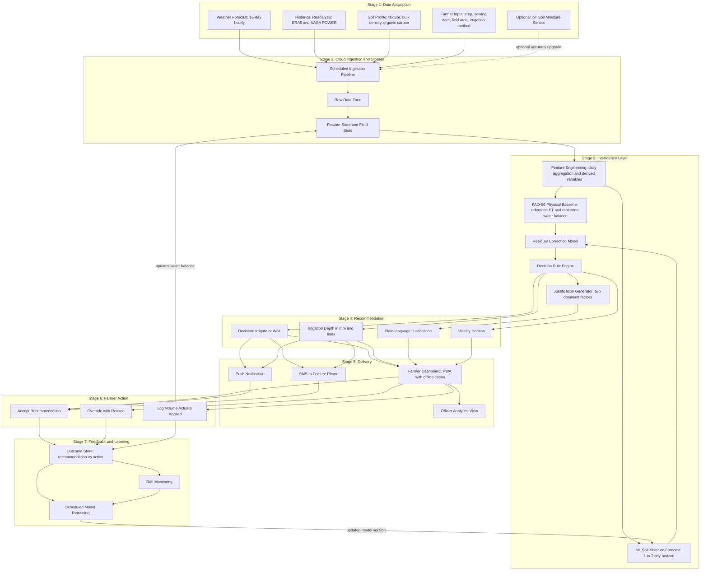
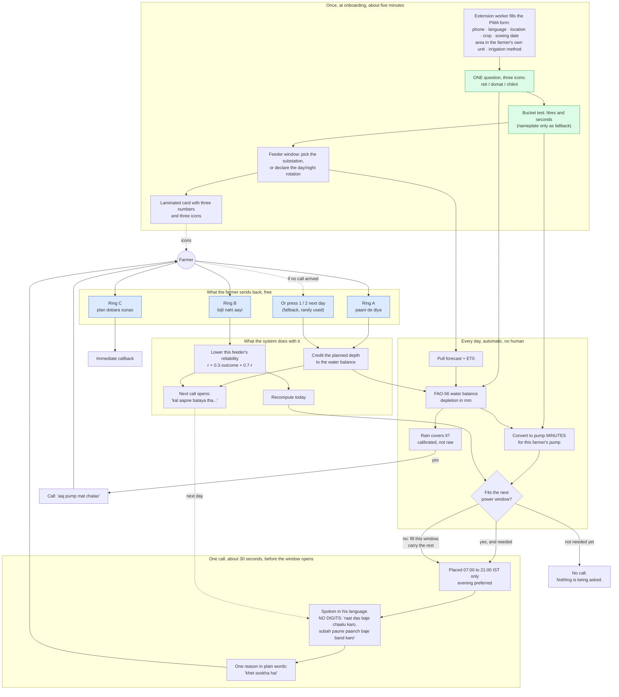

# Diagram 2 — Complete System Architecture

**Project:** Cloud-Based Smart Irrigation Recommendation using Weather Intelligence
**Course:** BITE412L — Cloud Computing | **Instructor:** Dr. Priya V

This diagram shows the overall project workflow end to end, from data acquisition
through to the feedback and learning loop.

---

## Diagram

---

## Stage-by-stage explanation

### Stage 1 — Data acquisition

Five inputs, of which only one is mandatory from the farmer. The sixteen-day
hourly forecast and the historical reanalysis arrive automatically from public
APIs. The soil profile is fetched once, at field registration, from the global
soil map. The farmer supplies four facts: crop, sowing date, field area and
irrigation method — nothing requiring measurement or equipment.

The IoT soil moisture sensor is drawn as a **dashed optional input**. This is the
architectural expression of the sensor-optional design: the arrow can be removed
and the system still functions.

### Stage 2 — Cloud ingestion and storage

The scheduled pipeline lands everything raw, then derives the feature set and the
per-field state. **The field state is the object that makes the system
anticipatory rather than reactive:** it carries the current root-zone water
deficit, days since last irrigation, accumulated evapotranspiration and current
growth stage forward from one day to the next.

This is a deliberately reduced digital twin. Most of the anticipatory value of a
twin comes from carrying state forward, which is cheap; the expense lies in
fidelity this application does not need.

### Stage 3 — Intelligence layer

Feature engineering feeds two parallel paths:

- **Physical path** — FAO-56 reference evapotranspiration and a root-zone water
  balance, producing a defensible baseline from first principles that works on day
  one for a field with no history.
- **Learned path** — root-zone soil moisture forecast over one to seven days.

The **residual correction model** reconciles the two, learning where the physical
baseline systematically deviates from observation for this soil and crop. This
physics-first-with-learned-residual structure bounds model error by physics and
removes the cold-start problem.

The **decision rule engine** converts the corrected trajectory into an action: if
predicted depletion crosses the crop's allowable threshold before the next
credible rainfall, irrigate now to the depth that restores field capacity; if
rainfall is expected to cover the deficit within the horizon, wait.

The **justification generator** identifies the two features that most influenced
the decision and phrases them in ordinary language.

### Stage 4 — Recommendation

The output is four things, not one number:

| Output | Example |
|---|---|
| Decision | Irrigate today / Wait |
| Depth | 18 mm — approximately 18,000 litres for 0.1 ha |
| Justification | "High evaporative demand since your last irrigation, and no rainfall forecast for four days." |
| Validity horizon | Valid for 48 hours; re-check thereafter |

The horizon is usually omitted in the literature but matters here: a
recommendation built on a forecast is only as trustworthy as that forecast.

### Stage 5 — Delivery

- **Dashboard (PWA)** — full picture with water-balance chart and history, caching
  the last recommendation so it remains readable with no network.
- **Push notification** — decision and depth to the app.
- **SMS** — the same two facts to a feature phone. This is the most important
  accessibility decision in the project; the surveyed literature consistently
  assumes smartphone access, and a recommendation that cannot be received is worth
  nothing.
- **Officer analytics view** — aggregation across fields for district oversight.

### Stage 6 — Farmer action

Three actions are possible: accept, override with a stated reason, or log the
volume actually applied. The override path is deliberate — the recommendation is
advice, not automation, and a farmer who knows something the model does not must
be able to say so without leaving the loop.

### Stage 7 — Feedback and learning

Every action lands in the outcome store alongside the recommendation it responded
to, producing a labelled record of what was advised and what was done. Drift
monitoring watches for divergence between predicted and observed conditions.
Scheduled retraining consumes accumulated outcomes and publishes an updated model
version back into Stage 3.

Separately, the **logged applied volume feeds directly back into the field state**,
correcting the water balance immediately rather than waiting for the next
retraining cycle. This is the short feedback arrow, and it is what keeps the water
balance honest between model updates.

---

## Why the two feedback arrows matter

They are what distinguishes this from a linear pipeline. Without them the system
would issue advice into a void and never learn whether it was right. With them:

- Every farmer action becomes a training label at no additional collection cost.
- The water balance self-corrects daily rather than drifting until the next
  retraining.
- Model drift becomes observable, because predicted and actual conditions are
  stored side by side.

---

*Phase-I: planning and documentation. This diagram describes the proposed
workflow; implementation begins in Phase-II.*

---

# Phase-II overlay: the farmer's day

Added 5 September 2026 by Aarush Pandit (23BIT0416). **The Phase-I diagram above
is unchanged.** Phase-I described the workflow in terms of data stages; this
describes it in terms of what actually happens to a farmer, because that is what
the Phase-II refinement changed.

## The five things this diagram is making a point about

1. **No hardware anywhere.** Soil comes from one spoken question, pump discharge
   from a bucket and a watch, the power window from a circular or the farmer's
   own account of his rotation. Nothing is installed in the field.
2. **The missed call is the sensor.** Rings A, B and C are the only state inputs
   after onboarding, and each is free to the farmer because the call is rejected
   without being answered.
3. **A call happens only when something is asked.** A day with no need produces
   silence, because a farmer called on days when nothing is wanted stops
   answering on the days when something is.
4. **The instruction is a clock time, not a duration.** He is told when to start
   and when to stop, in words, with the part of day attached. Not one digit
   reaches him.
5. **Feedback closes the loop with no extra call.** The acknowledgement rides on
   the next scheduled call, which is the only confirmation he ever gets that his
   missed call registered, and it lets him correct a wrong entry.
