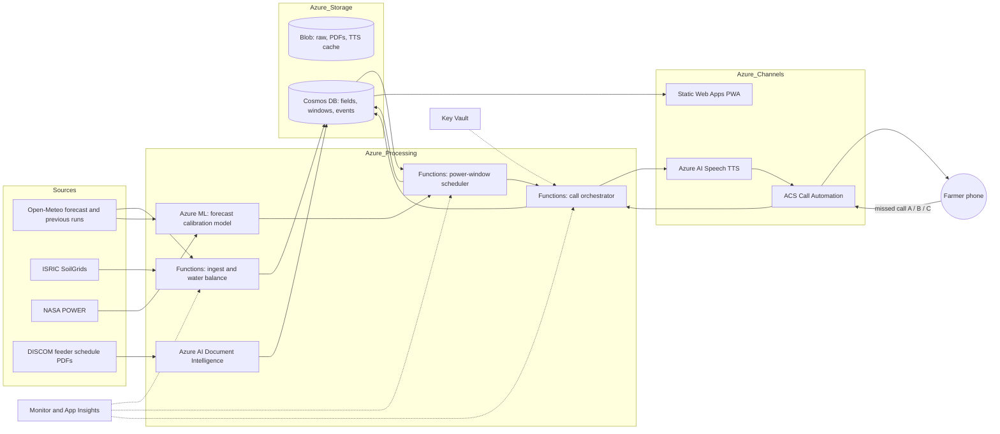

# Phase-II Scope Refinement: Power-Window-Aware, Voice-First Irrigation Scheduling

**Project (title unchanged):** Cloud-Based Smart Irrigation Recommendation using Weather Intelligence
**Course:** BITE412L Cloud Computing, Dr. Priya V, VIT
**Cluster:** C, Intelligent Agriculture and Food Security Cloud (SDG 2)
**Cloud platform:** Microsoft Azure
**Team:** 23BIT0390 Nayan Jaggi, 23BIT0416 Aarush Pandit, 23BIT0428 Krishna Agrawal
**Document status:** Phase-II planning, 2 September 2026. Supersedes the delivery-channel section of the Phase-I README; the Phase-I engine, data sources and Azure architecture are retained and extended.

---

## 1. Why the scope is being narrowed

Phase-I established a sensor-optional, forecast-driven FAO-56 irrigation engine on Azure. Faculty feedback after Review 1 asked for three things: a sharper novelty that no published system already offers, a user experience that a non-literate Indian farmer can actually operate, and a build that starts now. This document fixes that scope.

The refinement keeps the project title and the Phase-I objectives. It adds one hard constraint that every existing advisory ignores and one delivery channel that needs no literacy, no smartphone and no data pack.

## 2. The problem no advisory system addresses

Irrigation advisories, whether FAO-56 apps, IoT dashboards or the current wave of WhatsApp and LLM chatbots, answer a single question: *when does the crop need water?* For most Indian pump owners that is not the binding question. The binding question is *when can the pump run at all?*

Evidence, all from published sources (full references in Section 16):

1. Agricultural electricity in most Indian states is unmetered and rationed through limited daily supply hours; erratic and unannounced supply pushes farmers toward over-irrigation of water-intensive crops (Journal of Environmental Economics and Management, 2025, ref R1).
2. Where power is free at the margin but rationed to a few hours a day, farmers maximise pumping whenever supply arrives rather than conserving water (Journal of Development Economics, 2023, ref R2).
3. In Maharashtra, agricultural consumers receive power at fixed hours, mostly at night, on a rotating schedule (Asian Development Bank project document, ref R3). Night supply leads to pumps left running all night; an area that could be irrigated in one day takes four to five nights (ref R4).
4. DISCOMs publish the windows. MSEDCL's April 2026 circular fixes 8-hour daytime supply on agricultural feeders, staggered between 07:30 and 17:30 (ref R5), and its earlier circulars list substation-wise 8-hour windows such as 06:00 to 14:00 or 10:00 to 18:00 (ref R6). Punjab schedules 8 hours on agricultural feeders during paddy season (ref R7); Uttar Pradesh segregated feeders supply 07:00 to 17:00 (ref R8).

The consequence is an advisory that is agronomically correct and operationally useless: it tells a farmer to irrigate on Tuesday afternoon when the feeder is live on Tuesday night, and it tells him to apply 45 mm when his 5 HP pump cannot deliver that in one 8-hour window.

The only literature that couples irrigation scheduling with energy availability is optimisation of collective pumping stations under time-of-use tariffs (Spain, ref R9) and day-ahead scheduling of agricultural microgrids (ref R10, R11). These are grid-side or estate-side tools. No farmer-facing advisory in our search takes the DISCOM feeder window as a scheduling input.

## 3. Related work map

| System or paper | Year | Channel | On-farm hardware | Gives a quantity | Power-window aware | Usable without literacy or smartphone | Ref |
|---|---|---|---|---|---|---|---|
| Kissan-Dost (LUMS) | 2026 | WhatsApp text and voice, RAG + LLM | Yes, about USD 140 per entry setup | Qualitative ("water by tomorrow evening") | No | Needs smartphone and data | R12 |
| Farmer.Chat (Digital Green) | 2024 | WhatsApp / Telegram LLM | No | No, question answering | No | Needs smartphone | R13 |
| FarmChat (Jain et al.) | 2018 | App, text and voice, KCC knowledge base | No | No | No | Partly | R14 |
| Avaaj Otalo (Patel et al.) | 2010 | IVR voice forum | No | No | No | Yes | R15 |
| IWMI / eLEAF SMS advisory (Egypt, Sudan, Ethiopia) | 2014 | SMS codes, satellite ET | No | Yes, daily water balance | No | Text only | R16 |
| Smartphone SWB irrigation app for South and Southeast Asia | 2026 | Smartphone app, user-entered Kc, ETo | No | Yes, net and gross requirement | No | No | R17 |
| GREDRIP pumping-station DSS | 2018 | Operator tool | n/a | Yes | Tariff-aware, not rationing-aware | No | R9 |
| Agricultural microgrid day-ahead scheduling | 2021, 2024 | Optimisation model | n/a | Yes | Grid-level | No | R10, R11 |
| IMD Meghdoot / GKMS district agromet advisory | ongoing | App and SMS, district level | No | Generic guidance | No | Partly | [VERIFY current scope] |
| **This project, Phase-II** | 2026 | Outbound voice call, missed calls, icon-only PWA | **No** | **Yes, pump minutes inside a named window** | **Yes** | **Yes** | |

Search coverage: Google Scholar, ScienceDirect, MDPI, IEEE Xplore, arXiv and ICT-for-agriculture grey literature, August to September 2026, terms combining irrigation scheduling, advisory, farmer, power supply hours, feeder, rationing, IVR, missed call, WhatsApp. The claim of novelty is made relative to this search and is worded accordingly in all documents.

## 4. Novelty summary (one page)

**New feature.** The DISCOM agricultural feeder supply window is treated as a first-class scheduling constraint. Each recommendation names the window ("tonight, 22:00 to 06:00") and the pump running time inside it. No published farmer-facing advisory does this.

**Better algorithm.** A capacity-constrained refill policy replaces the standard "irrigate when depletion reaches RAW" trigger. The engine computes the net depth one power window can deliver for this pump and field, and refills early when the depletion approaches that capacity, so that a deficit is never allowed to grow beyond what one window can repay. A forecast-skip rule suppresses irrigation when calibrated rain probability covers the deficit before the next window.

**Better architecture.** Zero on-farm hardware. All inputs come from free public APIs (Open-Meteo, NASA POWER, ISRIC SoilGrids), published DISCOM schedules and the farmer's own missed calls, which act as the field sensor for irrigation-done and power-failed events.

**Better Azure integration.** Azure Communication Services Call Automation places the daily voice call and receives missed-call events; Azure AI Speech renders the script in the farmer's language; Azure AI Document Intelligence parses DISCOM schedule PDFs into feeder windows; Azure Functions, Cosmos DB and Blob Storage from Phase-I remain the processing and storage core.

**Better security.** Farmer identity is the phone number, verified by the missed call itself. No app login, no password, no personal data beyond field parameters. Secrets stay in Key Vault; Entra ID guards the operator dashboard only.

**Better automation.** The daily loop needs no human and no farmer action: forecast pull, water balance, scheduling, call, and state update from missed calls all run on timers and events.

**Better accuracy.** Recommendations are expressed in minutes for a specific pump, not millimetres for an abstract field, which removes the largest error source in practice: the farmer's guess of how long to run the pump. Forecast trust is calibrated per district and month from Open-Meteo previous-run forecasts against reanalysis, instead of a fixed probability threshold.

**Better scalability.** One Functions app serves any number of farmers because per-farmer cost is a daily API call, a Cosmos document and one voice call of roughly 30 seconds. No devices to ship, maintain or replace.

## 5. Farmer journey (illiterate-first design)

### 5.1 Onboarding (once, about five minutes, done by an extension worker, a village-level entrepreneur, a literate family member or the team during the pilot, on the PWA)

Collected: phone number, preferred language, village or GPS pin (soil and weather are looked up automatically), crop and sowing date, field area in local units (bigha, guntha, cent, acre), irrigation method (flood, furrow, sprinkler, drip), pump horsepower and either the delivery pipe size or a 15-litre bucket-fill time, feeder window source (select the substation from the parsed DISCOM schedule, or declare "day shift this week, night next week" with the rotation length), and spoken consent for a daily call.

### 5.2 The daily call (about 30 seconds, one hour before the window opens)

Hindi script, rendered by Azure AI Speech:

> राम काका, नमस्ते। आज रात बिजली दस बजे से सुबह छह बजे तक है। गेहूँ को पानी चाहिए। दस बजे पंप चालू करो, पैंतालीस मिनट चलाओ, फिर बंद कर दो। कल बारिश नहीं है। दोबारा सुनने के लिए एक दबाओ।

English equivalent: "Ram Kaka, namaste. Tonight power is from ten at night to six in the morning. The wheat needs water. Start the pump at ten, run it forty-five minutes, then stop. No rain tomorrow. Press one to hear again."

Skip variant:

> आज पंप मत चलाओ। कल बीस मिलीमीटर बारिश का अस्सी प्रतिशत मौका है। अगर बारिश नहीं आई तो हम परसों सुबह फोन करेंगे।

("Do not run the pump today. Eighty percent chance of twenty millimetres of rain tomorrow. If it does not rain we will call the day after tomorrow morning.")

Marathi, Tamil, Telugu and Punjabi scripts are produced with Azure Translator from the Hindi and English masters and must be checked by a native speaker before the pilot [PERSONALIZE].

### 5.3 Missed-call vocabulary (the field sensor)

Three toll-free numbers, printed as icons on a laminated card given at onboarding. A missed call costs the farmer nothing and requires no reading.

| Number | Icon on card | Meaning | System action |
|---|---|---|---|
| A | Blue drop with a tick | "Paani de diya" | Log irrigation event with today's planned depth; update water balance |
| B | Bulb with a cross | "Bijli nahi aayi" | Carry the deficit to the next window; lower this feeder's reliability score; re-plan |
| C | Ear | "Aaj ka plan sunao" | Immediate callback repeating today's script |

If neither A nor B arrives by the end of the window, the next call opens with one question: "Kal paani diya? Haan ke liye ek, nahi ke liye do." Keypress is the fallback, never the primary channel, because evaluations of IVR with Indian farmers found very low response to keypress prompts (ref R18). The best-answered call times in the same evaluations were early evening, which matches the pre-window timing above (ref R19).

### 5.4 Icon-only PWA (for the demo, extension workers and literate family members)

Three large tiles, no text needed: pump (with minutes and a start-time clock), bulb (window bar on a 24-hour ring), cloud (rain probability as a filling drop). Every tile speaks when tapped using the same Azure AI Speech audio. A fourth screen shows the seven-day water balance as a filling bucket. Text labels are present but secondary, in the selected language.

### 5.5 Design rules

1. Never say millimetres, evapotranspiration, depletion or percent soil moisture to a farmer. Only minutes, clock times, "paani chahiye / nahi chahiye" and rain in familiar words.
2. One decision per call. One number per decision.
3. Every recommendation carries a one-line reason in plain words ("kal baarish hai", "khet sookha hai", "bijli raat ko hai").
4. The farmer's missed call is always right. If he says water was given, the balance is updated even if the model disagrees.
5. Consent is recorded at onboarding and the daily call is user-requested, which is the transactional pattern rather than promotional broadcast [VERIFY against TRAI TCCCPR 2018 before the pilot].

## 6. Decision engine (FAO-56, unchanged from Phase-I, extended)

Notation follows FAO Irrigation and Drainage Paper 56 (ref R20).

- Reference evapotranspiration ET0 is taken from Open-Meteo's `et0_fao_evapotranspiration` daily variable and cross-checked against the project's own Penman-Monteith implementation (Phase-I Objective 2).
- Crop evapotranspiration ETc = Kc × ET0, with Kc for initial, mid and late stages from FAO-56 Table 12 and stage lengths from Indian crop calendars (ICAR and state agricultural university packages of practice) [VERIFY per crop].
- Soil water constants from ISRIC SoilGrids (sand, clay, organic carbon, bulk density) through the Saxton and Rawls (2006) pedotransfer functions to field capacity θFC and wilting point θWP (ref R21).
- Total available water TAW = 1000 (θFC − θWP) Zr, readily available water RAW = p × TAW, with rooting depth Zr and depletion fraction p from FAO-56 Table 22, p adjusted for ETc as p + 0.04 (5 − ETc).
- Daily root-zone depletion Dr,i = Dr,i−1 − (P − RO)i − Ii + ETc,i + DPi (FAO-56 equation 85). Effective rainfall uses a configurable minimum (default: daily rain under 3 mm is ignored) and an optional SCS curve-number runoff term.

Depth to pump minutes:

- Gross depth = net depth / Ea, with application efficiency Ea defaults flood or basin 0.55, furrow 0.65, sprinkler 0.75, drip 0.90 (FAO Training Manual 4 ranges, ref R22), editable per farmer.
- Volume (litres) = gross depth (mm) × area (m²).
- Pump discharge Q (L/min) either from the bucket test (15 L ÷ seconds × 60) or estimated as Q = HP × 746 × η ÷ (9.81 × H) litres per second with combined efficiency η = 0.5 and total head H in metres from the declared borewell depth [VERIFY η and head defaults with a local pump dealer or KVK].
- Pump minutes = volume ÷ Q.

Worked example: wheat at mid-season, one acre (4,047 m²), depletion 25 mm, furrow irrigation (Ea 0.65), 5 HP pump at 30 m head (Q ≈ 380 L/min). Gross depth 38.5 mm, volume 155,800 L, pump time ≈ 410 minutes, which fits an 8-hour window with margin. At 45 mm depletion the same field needs about 740 minutes and would spill into a second window, which is exactly the situation the scheduler is built to avoid.

## 7. Power-window scheduler

Inputs per farmer per day: current depletion D, RAW, forecast ETc for the next seven days, calibrated rain forecast, the ordered list of upcoming power windows W1, W2, ... (start, end, source, reliability r), pump discharge Q, area, Ea, and the crop's yield-response sensitivity Ky at the current stage.

Derived: net capacity of one window C = Q × duration(W) × Ea ÷ area (mm).

Policy, evaluated once per day one hour before W1:

```
D_skip = projected depletion at the start of W2 if no irrigation happens in W1
         (D + sum of forecast ETc − expected effective rain over that horizon)

if rain_covers(D, horizon = start of W2, confidence = calibrated):
    SKIP with reason "rain"; schedule a check call the morning after the rain
elif D_skip > RAW:
    IRRIGATE in W1 (mandatory); minutes = min(D / Ea → minutes, duration(W1))
    if truncated: carry remainder to W2 and say so in the call
elif D >= C and D >= 0.5 × RAW:
    IRRIGATE in W1 (opportunistic full-window refill)
else:
    WAIT; no call today unless a schedule change or rain change occurred
```

Extensions implemented in the same module:

- Multiple fields on one pump: window minutes are allocated in priority order of (D ÷ RAW) × Ky, with the remainder carried over.
- Feeder reliability r is the exponentially weighted share of past windows for which no "bijli nahi aayi" missed call arrived. When r drops below 0.6 the call says "jab bijli aaye, X minute" instead of a clock time, and the window duration used for C is scaled by r.
- Window source precedence: farmer's missed call today, then DISCOM published schedule, then declared rotation.

## 8. Forecast-skip and its calibration model (AI / ML module)

The skip rule needs to know how much to trust "80 percent chance of 20 mm". The calibration model (owner: Krishna Agrawal) learns, per district and month, the probability that observed rain over the horizon reaches the deficit given the forecast probability and amount. Training pairs are built from Open-Meteo Previous Runs (forecasts issued on earlier days) against the Open-Meteo Historical Archive (ERA5-Land) for the same grid cell and date; NASA POWER provides an independent check. A gradient-boosted classifier or a monotone logistic model on (forecast probability, forecast amount, lead time, month, district) is sufficient. The output is a calibrated probability that feeds `rain_covers`.

The Phase-I LSTM soil-moisture forecast (Objective 3) is retained as the seven-day ETc driver; if its validation misses the R² target, the engine falls back to Kc × forecast ET0 with no change to the scheduler.

## 9. Feedback loop without sensors

Missed calls A and B and the fallback keypress are the only state inputs after onboarding. Irrigation events are logged at the planned depth (farmer confirmations override the model); power-failure events shift the schedule and update r. Over a season the logged minutes and events allow two learned corrections: the ratio of confirmed to planned irrigations per farmer (behavioural compliance), and, where a rain gauge or ISMN station is nearby, a per-district bias term on ETc. Both are Phase-III items and are listed here only so the data model captures the events from day one.

## 10. Azure architecture delta

Phase-I services are retained. Additions and role changes:

| Azure service | Phase-I role | Phase-II role |
|---|---|---|
| Azure Functions (Python) | Ingest, recommendation, notification dispatch | Adds timer-triggered scheduler, ACS event webhooks (missed calls, call outcomes), Document Intelligence pipeline trigger |
| Azure Cosmos DB | Per-field state | Adds collections: `feeder_windows`, `call_events`, `missed_call_events`, `schedules` |
| Azure Blob Storage | Raw zone, model artefacts | Adds DISCOM schedule PDFs and cached TTS audio per script hash |
| Azure Communication Services | SMS | Call Automation: outbound voice call with TTS prompt and DTMF recognise; inbound call events for missed-call numbers (call is rejected, never answered, so it stays free for the farmer) |
| Azure AI Speech | Not used | Neural text-to-speech in hi-IN, mr-IN, ta-IN, te-IN, pa-IN [VERIFY exact voice names at build time] |
| Azure AI Translator | Not used | Draft translations of the master scripts, verified by native speakers |
| Azure AI Document Intelligence | Not used | Table extraction from DISCOM feeder schedule circulars into `feeder_windows` |
| Azure Static Web Apps | Farmer dashboard | Icon-only PWA and operator onboarding screen |
| Azure Machine Learning | Train and register | Adds forecast calibration model training job and registered model |
| Azure Key Vault, Monitor, Application Insights, Entra ID | As Phase-I | Unchanged; Entra ID protects the operator screen only |

Mermaid update for Diagram 1 (Phase-II overlay):



## 11. Data sources delta

Phase-I sources D1 to D6 are unchanged. Added:

| # | Source | Type | Licence | Role |
|---|---|---|---|---|
| D7 | MSEDCL agricultural feeder (AgLM) time-schedule circulars, mahadiscom.in | PDF tables: substation, feeder, 8-hour window | Public government circular [VERIFY reuse terms] | Ground truth for power windows in the Maharashtra pilot districts |
| D8 | Open-Meteo Previous Runs API | Forecasts as issued on earlier days | CC BY 4.0 | Training pairs for the forecast calibration model |
| D9 | Farmer missed-call and call-outcome events (own data, pilot) | Event log | Own, consented | Feedback loop, reliability score, compliance metrics |

## 12. Evaluation plan

1. **Simulation study (Krishna, with Aarush's engine).** Three districts (Vellore TN, Beed MH, Ludhiana PB), three crops each, two seasons of Open-Meteo archive weather. Four policies compared: fixed-interval calendar irrigation; unconstrained FAO-56 trigger at RAW; FAO-56 plus power-window scheduler; scheduler plus forecast-skip. Metrics per policy: total water applied (mm), stress days (Dr above RAW), pump hours, estimated kWh (HP × 0.746 × hours), deep percolation (mm), number of windows used.
2. **Usability (Nayan).** Five to ten farmers or farming family members: can they state the recommendation after one call, can they perform the three missed-call actions from the card, call answer rate over one week, spoken SUS-style questions in the local language.
3. **System (Aarush).** End-to-end latency from forecast pull to call placed, cost per farmer per season on Azure for Students pricing, call completion rate, scheduler decisions traced in Application Insights.

## 13. Work distribution, Phase-II

| Module | Student 1, 23BIT0390 Nayan Jaggi | Student 2, 23BIT0416 Aarush Pandit | Student 3, 23BIT0428 Krishna Agrawal |
|---|---|---|---|
| Frontend: icon-only PWA, onboarding screen, call script masters, laminated card design | Owner | Review | Review |
| Backend: FAO-56 engine, pump-minutes conversion, power-window scheduler, event model | Review | Owner | Review |
| Azure: Functions, Cosmos DB, Blob, ACS Call Automation, AI Speech, Document Intelligence, Key Vault, Monitor, Bicep IaC, CI | Contributor | Owner | Contributor |
| AI / ML: forecast calibration model, LSTM retention decision, simulation study | Review | Contributor | Owner |
| Testing: engine unit tests, scheduler property tests, call-flow simulation tests | Contributor | Contributor | Contributor |
| Documentation and presentation | Contributor | Contributor | Contributor |

Each student raises at least one pull request per sprint from their own feature branch to `develop`, reviews at least one PR from another member per sprint, and keeps weekly commits.

## 14. Six-week sprint plan (from 2 September 2026)

| Week | Deliverable | Acceptance |
|---|---|---|
| 1 | Engine library with unit tests: ET0 cross-check, Kc calendar, Saxton-Rawls, water balance, pump minutes. Cosmos data model. `docs/PHASE2_NOVELTY_AND_PLAN.md` merged. | All tests green in CI; ET0 within ±0.2 mm/day of reference values |
| 2 | Power-window scheduler with property tests; DISCOM PDF parser via Document Intelligence on two real MSEDCL circulars; feeder window model | Scheduler never exceeds window length; parsed windows match the circular tables for a sample of 20 feeders |
| 3 | Call orchestrator with a simulated telephony adapter (browser call console) and the ACS adapter behind a feature flag; Azure AI Speech audio for Hindi and English scripts; missed-call state machine | Full daily loop runs for three sample farmers with real Open-Meteo data; audio plays; missed calls update state |
| 4 | Icon-only PWA on Static Web Apps; onboarding screen; forecast calibration model v1 trained from Previous Runs vs archive for the three pilot districts | PWA passes a no-text walkthrough; calibration Brier score better than the raw forecast probability |
| 5 | Simulation study over two seasons; results tables and plots in `results/`; Application Insights dashboards; Bicep deployment reproducible from scratch | Four-policy comparison complete with the metrics in Section 12 |
| 6 | Pilot usability round with five to ten participants; report and presentation; `develop` merged to `main`; tag `v2.0-Phase2` | Review-ready soft copy with updated diagrams, dataset table and contribution matrix |

## 15. Risks and verification items

| Risk | Mitigation |
|---|---|
| ACS phone number availability for India and outbound PSTN rates [VERIFY in the Azure portal] | Build behind an adapter; demo with the simulated telephony console and Azure AI Speech audio; enable ACS when a number is provisioned |
| Regulatory limits on automated calls (DND registry, calling hours) | Consent at onboarding; calls are farmer-requested and transactional; document the TRAI position before the pilot |
| Voice names and language coverage in Azure AI Speech | Confirm at build time; keep Hindi and English as guaranteed masters |
| Pump discharge estimate error | Bucket test at onboarding; learn from "paani de diya" confirmations over the season |
| DISCOM schedule PDFs change format | Document Intelligence table extraction plus a validation step; farmer-declared rotation as fallback |
| Crop calendar values for Indian varieties | Source from ICAR and state university packages of practice; mark unverified entries in code as TODO [VERIFY] |

## 16. References

R1. Removing rationing: Power consumption and groundwater monitoring in South India. Journal of Environmental Economics and Management, 2025. https://www.sciencedirect.com/science/article/abs/pii/S0095069625001287 [VERIFY authors and volume for IEEE citation]
R2. Efficient irrigation and water conservation: Evidence from South India. Journal of Development Economics, 2023. https://www.sciencedirect.com/science/article/abs/pii/S0304387823000068 [VERIFY authors and volume]
R3. Asian Development Bank. Maharashtra Power Distribution Enhancement Program for Agricultural Solarization, project 58396-001. https://www.adb.org/projects/58396-001/main
R4. Making agriculture sustainable: solarising farm feeders (grey literature, 2019). https://www.linkedin.com/pulse/making-agriculture-sustainable-solarising-farm-feeders-saurabh-kumar [grey; use only as supporting context]
R5. MSEDCL. Letter to field, AgLM time schedule May to June 2026, 30 April 2026. https://www.mahadiscom.in/wp-content/uploads/2026/04/Letter-to-field_AGLM-time-Sch_May26-June26_30.04.2026.pdf
R6. MSEDCL. Time schedule circular, 1 October 2020, with annexure of substation-wise 8-hour windows. [VERIFY original mahadiscom.in link; a mirror exists on Scribd]
R7. PSPCL increases power supply to agricultural feeders, PSU Watch, July 2026. https://psuwatch.com/newsupdates/pspcl-substantially-increases-power-supply-to-agri-feeders
R8. With segregated feeders, UPPCL plans 10-hr power to farmers. Hindustan Times, Lucknow, 18 November 2018.
R9. Model for management of an on-demand irrigation network based on irrigation scheduling of crops to minimize energy use (Part I): Model development. Agricultural Water Management, 2018. https://www.sciencedirect.com/science/article/abs/pii/S0378377418304670 [VERIFY authors]
R10. Stochastic day-ahead scheduling of irrigation system integrated agricultural microgrid with pumped storage and uncertain wind power. Energy, 2021. https://www.sciencedirect.com/science/article/abs/pii/S0360544221018867 [VERIFY authors]
R11. Day-ahead scheduling model for agricultural microgrid with pumped-storage hydro plants considering irrigation uncertainty. Journal of Energy Storage, 2024. https://www.sciencedirect.com/science/article/abs/pii/S2352152X24020541 [VERIFY authors]
R12. M. S. Ali, D. U. Khan, L. I. Ahmad, U. Irfan, M. Mustafa, N. A. Bhatti and M. H. Alizai. Kissan-Dost: Bridging the Last Mile in Smallholder Precision Agriculture with Conversational IoT. arXiv:2602.08593, 2026.
R13. N. Singh et al. Farmer.Chat: Scaling AI-powered agricultural services for smallholder farmers. arXiv, 2024. [VERIFY arXiv identifier]
R14. M. Jain et al. FarmChat: A conversational agent to answer farmer queries. Proc. ACM IMWUT (UbiComp), 2018. [VERIFY DOI]
R15. N. Patel et al. Avaaj Otalo: A field study of an interactive voice forum for small farmers in rural India. CHI 2010. [VERIFY DOI]
R16. IWMI, eLEAF, DLV Plant. New SMS service connects farmers to weather and water information. CGIAR WLE, 2014. https://wle.cgiar.org/thrive/2014/03/10/new-sms-service-connects-farmers-weather-and-water-information
R17. A smartphone-based application for crop irrigation estimation in selected South and Southeast Asia countries. Sustainability, 18(2), 990, 2026. https://www.mdpi.com/2071-1050/18/2/990 [VERIFY authors and DOI]
R18. IDinsight. IVR and text message interventions to provide fertilizer information to farmers: experiments from India, 2019. https://medium.com/idinsight-blog/ivr-and-text-message-interventions-to-provide-fertilizer-information-to-farmers-16e651402be6
R19. ICTworks. When is the best time to send IVR and SMS messages to farmers? 2022. https://www.ictworks.org/send-ivr-sms-messages-farmers/
R20. R. G. Allen, L. S. Pereira, D. Raes and M. Smith. Crop evapotranspiration: Guidelines for computing crop water requirements. FAO Irrigation and Drainage Paper 56, 1998.
R21. K. E. Saxton and W. J. Rawls. Soil water characteristic estimates by texture and organic matter for hydrologic solutions. Soil Science Society of America Journal, 70(5), 1569 to 1578, 2006.
R22. C. Brouwer, K. Prins and M. Heibloem. Irrigation Water Management: Training Manual No. 4, Irrigation Scheduling. FAO, 1989.
R23. Microsoft Learn. Azure Communication Services Call Automation overview and Recognize action. https://learn.microsoft.com/en-us/azure/communication-services/concepts/call-automation/recognize-action
R24. J. Doorenbos and A. H. Kassam. Yield response to water. FAO Irrigation and Drainage Paper 33, 1979. Source of the yield response factor Ky, which does not appear in FAO-56.
R25. P. Steduto, T. C. Hsiao, E. Fereres and D. Raes. Crop yield response to water. FAO Irrigation and Drainage Paper 66, 2012. Updated stage-wise Ky values superseding FAO-33 where the two differ.

---

## 17. Reconciliation with Phase-I commitments (added 2 September 2026 after Claude Code M0 orientation)

**Principle.** Phase-I documents are a submitted and graded record. They are not rewritten. Phase-II is recorded as a scope refinement made on instructor feedback after Review 1. Every Phase-I objective, service, dataset and technology keeps its entry and receives a Phase-II status. Where the build order or the delivery channel changes, the change and its reason are stated in an addendum, never by silent edit.

### 17.1 Novelty framing

Phase-I named the gap as translation and delivery: turning free forecast, reanalysis and soil data into a specific instruction through a channel the farmer already uses. Phase-II does not replace that gap; it fixes both halves of it. The translation target becomes pump minutes inside the farmer's rationed electricity window, which no published advisory produces, and the delivery channel becomes a voice call plus missed calls, which needs no literacy, smartphone or data pack. This sentence goes into the README under a new "Phase-II scope refinement" heading, and the supporting economics and policy sources (R1 to R8) are added as `literature_survey/phase2_addendum.md`, clearly marked as supplementary reading beyond the fifteen mandated papers, which remain untouched.

### 17.2 Objective mapping

| Phase-I objective (verbatim intent) | Phase-II status | Delivered by | Acceptance criterion |
|---|---|---|---|
| 1. Scheduled cloud pipeline ingesting forecast, reanalysis and soil data for every registered field | Retained unchanged | M1 providers, M3 timer-triggered Functions | Retained: ingestion success ≥ 99 percent over 30 days, no field with forecast older than 24 hours, measured in Application Insights |
| 2. FAO-56 ET0 and root-zone water balance producing an irrigation depth in millimetres | Retained unchanged; pump minutes is a downstream conversion of the millimetre depth, which is still computed, stored and shown to operators | M1 engine | Retained: ET0 within ±0.2 mm/day of the Penman-Monteith cross-check on ≥ 365 station-days from NASA POWER and Open-Meteo archive |
| 3. Model forecasting root-zone soil moisture 1 to 7 days ahead | Retained, moved off the critical path. The scheduler consumes it through a `MoistureForecaster` interface with a Kc × forecast ET0 fallback. The forecast calibration model is an additional deliverable | Krishna Agrawal, weeks 4 to 5 | Retained: R² ≥ 0.80 on a held-out season. If not met by week 5 the shortfall is reported honestly and the fallback stays active |
| 4. Daily decision, depth, justification and validity horizon via dashboard and push/SMS | Extended. Dashboard becomes the icon-only PWA; ACS SMS is kept as the text fallback for literate users; web push is retained if time permits; the voice call and missed-call channel are added as the primary farmer channel | M3, M4 | Retained: end-to-end latency under 5 minutes for 95 percent of recommendations; every record carries a non-empty justification |
| 5. Secure and observable deployment on Azure | Retained. "Private endpoints or authenticated gateways" is met through authenticated gateways: API Management (consumption tier) and Entra ID authentication on operator endpoints, Cosmos DB with managed identity and local key authentication disabled, Key Vault with RBAC. Virtual Network and private endpoints are deferred to Phase-III on cost grounds | M5 Bicep | Retained: zero secrets (gitleaks in CI), authenticated gateways on every data-plane service, ≥ 5 Azure Monitor alert rules in Bicep |
| 6. Quantify water saved against a fixed-interval baseline in simulation | Retained and strengthened. The four-policy simulation in Section 12 is this objective; the fixed-interval calendar policy is the baseline | M6 with Krishna's simulation script | Retained: ≥ 20 percent reduction in applied water with no increase in modelled stress days, now reported per policy |

### 17.3 Azure services status

| Status | Services | Reason |
|---|---|---|
| Deployed in Phase-II (Bicep) | Functions, Blob Storage, Cosmos DB, Key Vault, Application Insights, Monitor alert rules, Static Web Apps, Communication Services (SMS and Call Automation), AI Speech, AI Document Intelligence, AI Translator, Entra ID (operator authentication), API Management consumption tier, Machine Learning workspace (training runs, minimal compute), GitHub Actions | Core loop and the services needed by Objectives 1 to 6 |
| Declared in Phase-I, deferred to Phase-III with a named substitute | Data Factory (Functions timer orchestrates at pilot scale), SQL Database (Cosmos DB holds state; relational audit added when required), Cache for Redis (forecast cached in Blob with TTL), Service Bus (Storage Queue triggers), Notification Hubs (web push via PWA), Virtual Network and Front Door with WAF (cost on the student subscription), Container Registry and App Service (no containers needed yet), Backup (Cosmos DB continuous backup mode instead), Power BI (results plots committed under `results/`) | Cost and time on Azure for Students credit; each substitute meets the same functional need at pilot scale |

The Azure services planning table in the report gains a Status column with these values so that the reviewer sees the full declared set and what is live.

### 17.4 Technology stack and datasets

- Frontend stays React 18 with Vite, Tailwind CSS and a PWA service worker as declared. Nayan Jaggi remains the owner; the code is prepared in the handoff package and built by the Static Web Apps GitHub Action.
- Backend stays Python 3.11 with FastAPI, hosted on Azure Functions through the ASGI integration (`AsgiFunctionApp`), so the declared "FastAPI plus Azure Functions Python worker" is exactly what runs.
- Farmer-facing script masters are Hindi, English and Tamil (the Vellore demo farmer). Marathi, Telugu and Punjabi are generated with Azure AI Translator later. All non-English scripts are checked by a native speaker before the pilot [PERSONALIZE].
- Datasets D1 to D4 are unchanged. D5 (Kaggle labelled irrigation data) is retained as optional training input for Objective 3 and marked "optional, Objective 3 only". D6 (International Soil Moisture Network) is retained as the independent validation set for Objective 3. D7 to D9 are added. Nothing is withdrawn.

### 17.5 Team scope

No teammate's scope shrinks. Nayan Jaggi owns the complete frontend (PWA, onboarding, voice script masters, laminated card design, usability round). Krishna Agrawal owns the complete AI/ML scope (Objective 3 soil-moisture model, forecast calibration model, four-policy simulation). Aarush Pandit owns backend, scheduler, Azure infrastructure, telephony and speech integration, CI and documentation compilation. `docs/WORK_DISTRIBUTION.md` receives a Phase-II addendum table; the Phase-I table stays.

### 17.6 Repository hygiene rulings

- `.gitignore` gains `!results/**/*.csv`, `!results/**/*.png` and `!tests/fixtures/**/*.csv` so simulation outputs and parser fixtures are versioned; raw downloads under `data/raw/` stay ignored.
- Working clone lives at a normal path (`Projects/SmartIrrigation_Azure_Cloud_Project_2026`), not under AppData; stale copies under Downloads are not used.
- Git identity for the operator is the GitHub noreply address so every commit attributes to the account being graded.
